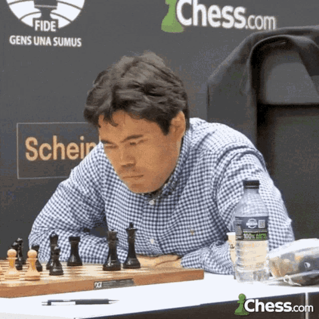

#  SCAN-dinavian: A Chess Board Position Recognition Model  

> **Real-world chess board → Engine-ready FEN notation in under a second**  

---


##  Overview  
**SCAN-dinavian** is a deep learning model that automatically recognizes real-world chess positions from images and converts them into **FEN (Forsyth–Edwards Notation)** strings.  
Built with **Python**, **PyTorch**, **TorchVision**, and **PyTorch Lightning**, it enables seamless integration with chess engines like **Stockfish** for instant analysis.

---


##  Features  
- **EfficientNetV2-S Backbone**: Convolutional neural network for piece & color recognition.  
- **Simultaneous Square Inference**: Predicts both piece type and color for all **64 squares** in one pass.  
- **Fast Conversion**: Generates engine-ready **FEN strings** per board.  
- **Hybrid Dataset**:  
  - 3,000+ Unity-rendered synthetic chessboard images.  
  - 9,500+ crowdsourced real-world chessboard images.  
- **High Accuracy**:  
  - **Binary accuracy** (piece vs empty): 99.9%  
  - **Color accuracy** (white vs black): 97.4%  
  - **Full per-square accuracy**: 95.0%  
- **100 Training Epochs**: Optimized for generalization across varied lighting, angles, and boards.  

---

##  Installation  

```bash
git clone https://github.com/h4rshhh/SCANdinavian.git
cd SCANdinavian
pip install -r requirements.txt
